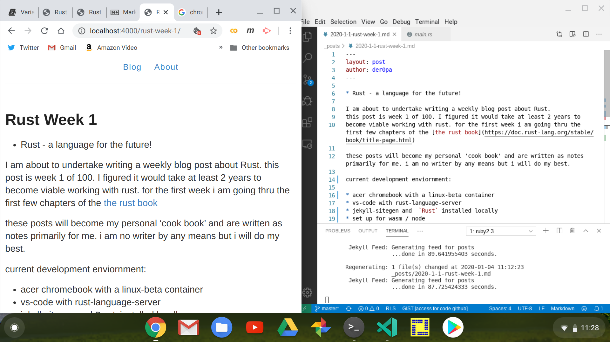

* Rust - a language for the future!

I am about to undertake writing a weekly blog post about Rust. 
this post is week 1 of 100. I figured it would take at least 2 years to 
become viable working with rust. for the first week i am going thru the first few chapters of the [rust book](https://doc.rust-lang.org/stable/book/title-page.html)  

these posts will become my personal 'cook book' and are written as notes primarily for me. i am no writer by any means but i will do my best.
 
current development enviornment:

* acer chromebook with a linux-beta container
* vs-code with rust-language-server 
* jekyll-sitegen and  `Rust` installed locally 
* set up for wasm / node  
* jekyll on github-pages [der0pa.github.io](https://der0pa.github.io) 




finished code from the guessing game tutorial is below



link is not currently working.
[test-1](https://drive.google.com/open?id=1KZhgMm36m8h_jWLcYxJB281gS5ddMFqL)


more to come...

consumed all of 'lin clarks' talks and blog posts on wasm-wasi-wasmtime. she is a very good teacher. 

random shit:

the `char` type in rust is four bytes in size and represents a Unicode scalar Value. 

```
 U+D7FF

 fn main() {
    let c = 'z';
    let z = 'ℤ';
    let heart_eyed_cat = '😻';
}

Integer Types in Rust

Length	Signed	Unsigned
8-bit	i8	u8
16-bit	i16	u16
32-bit	i32	u32
64-bit	i64	u64
128-bit	i128	u128
arch	isize	usize
```

```
Integer Literals in Rust

Number literals	Example
Decimal	        98_222
Hex	            0xff
Octal	        0o77
Binary	        0b1111_0000
Byte (u8 only)	b'A'
```
Floating-Point Types

f32 and f64 - 32 bits and 64 bits -respectively

Numberic Operations in Rust.

```
fn main() {
    // addition
    let sum = 5 + 10;

    // subtraction
    let difference = 95.5 - 4.3;

    // multiplication
    let product = 4 * 30;

    // division
    let quotient = 56.7 / 32.2;

    // remainder
    let remainder = 43 % 5;
}

```

Booleans are of **true** or **false** values.

Compound Types  :: tuples and arrays.

```
fn main() {
    let tup = (500, 6.4, 1);

    let (x, y, z) = tup;

    println!("The value of y is: {}", y);
}
```

Loops / move to control flows section

 

rust code above outputs to the console as follows below:
```
   Compiling loops v0.1.0 (/home/395currahee/projects/der0pa.github.io/rust-code/loops)
    Finished dev [unoptimized + debuginfo] target(s) in 9.20s
     Running `target/debug/loops`
3
2
1
LIFTOFF!
The result is 20
Hello, world!
the value is: 10
the value is: 20
the value is: 30
the value is: 40
the value is also: 10
the value is also: 20
the value is also: 30
the value is also: 40
the value is also: 50
4!
3!
2!
1!
LIFTOFF!!!
395currahee@penguin:~/projects/der0pa.github.io/rust-code/loops$ 
```
some vector coding in rust:



create a vector:

#### let a: [i32; 5] = [1, 2, 3, 4, 5];
same as below - vec! is a macro 
#### let mut v = vec![1, 2, 3, 4, 5];

functions work sheet: 

below is the console output
```
395currahee@penguin:~/projects/der0pa.github.io/rust-code/rust-functions$ cargo run
    Finished dev [unoptimized + debuginfo] target(s) in 0.05s
     Running `target/debug/rust-functions`
1the value of x is: 5
2the value of y is: 6
3the value of x is: 5
4the value of y is: 5
5the value of x is: 5
6the value of x is: 9
```
end week one


